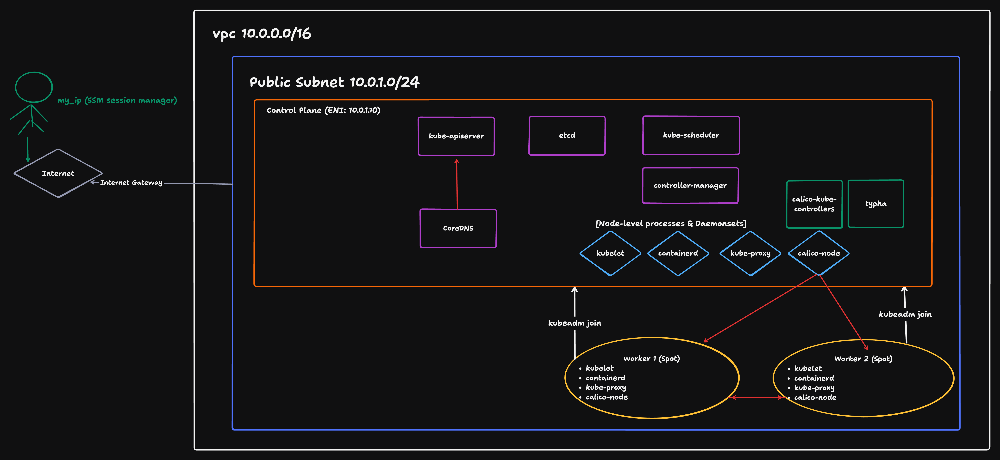

# kubeadm-cluster

Terraform-based IaC project to provision a kubeadm Kubernetes cluster on AWS.

Sandbox environment for Kubernetes internals (etcd, apiserver, scheduler, controller-manager) using kubeadm instead of EKS.

## Architecture



## Prerequisites

- AWS CLI configured (`aws configure`)
- Terraform >= 1.14.0
- Public IP (`curl -s ifconfig.me`)

## Quick Start

```bash
git clone https://github.com/play-builder/kubeadm-cluster.git
cd kubeadm-cluster

cp terraform.tfvars.example terraform.tfvars

terraform init
terraform plan
terraform apply

aws ssm start-session --target <instance-id>
sudo su - ubuntu
tail -f /var/log/kubeadm-bootstrap.log

# Verify Calico (auto-installed via Tigera Operator)
kubectl get tigerastatus
kubectl get pods -n calico-system

# Get join command on control plane
cat /home/ubuntu/join-command.sh

# Join each worker (connect to each worker via SSM, then run)
aws ssm start-session --target <worker-instance-id>
sudo <paste join command>

kubectl get nodes
```

## Cleanup

```bash
terraform destroy
```

## Tech Stack

| Tool         | Version   | Purpose                 |
| ------------ | --------- | ----------------------- |
| Terraform    | >= 1.14.0 | Infrastructure as Code  |
| AWS Provider | ~> 6.0    | AWS resource management |
| Kubernetes   | 1.35      | Container orchestration |
| containerd   | v2.2.x    | CRI runtime             |
| Calico       | v3.31.4   | CNI plugin              |
| Ubuntu       | 24.04 LTS | Node OS                 |
